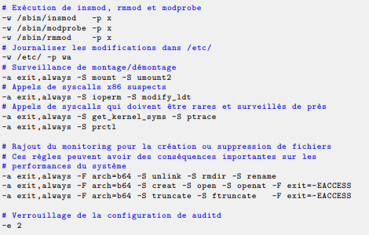

# WIKI SECU LINUX	
Ce rapport présente certaines mesures de sécurité Linux Debian à appliquer, les mesures de sécurité sont divisées en différentes configurations : minimale, recommandée et renforcée.
Toutes les sources sont disponibles en fin de rapport

# Audit et analyse de la sécurité du système

De nombreux outils sont disponibles afin d'évaluer le niveau de sécurité et de protection d'un système, ces outils analysent les applications et services installés puis en déduisent une liste d'améliorations possibles, et annoncent le niveau de maturité du système audité.

Sous Debian, les outils suivants peuvent être utilisés :
1. Debsecan : apt-get install $(debsecan --suite NOM_SUITE --only-fixed --format packages) puis debsecan --suite $(lsb_release --codename --short) --only-fixed --format detail
2. Lynis : apt update && apt install lynis. On lance l'audit via la commande lynis audit system. Le rapport est enregistré sous : /var/log/lynis-report.dat (Guide d'utilisation : https://opensource.com/article/20/5/linux-security-lynis)

# Configuration minimale
## Configuration de PAM

PAM va fournir le service de gestion de comptes, c’est-à-dire permettre l’authentification de l’utilisateur, la création de sa session et éventuellement toute opération qui doit se dérouler lors de la tentative d’accès : création d’environnement, récupération de tickets ou de données, droits d’accès, changement de mot de passe, etc.
Les fichiers de configuration des modules PAM se situent dans /etc/pam.d/

- Il faut limiter le nombre d'applications utilisant PAM, pour savoir si une application a été écrite pour utiliser PAM on utilise la commande "ldd". Exemple : ldd /etc/sbin/sshd, le résultat contient bien "libpam.so".

- Authentication par un serice distant : on s'assure de que le protocole d'authentification utilisé par PAM soit sécurisé, on pourra par exemple implémenter le module "pam_krb5" pour utiliser le protocole Kerberos (https://www.eyrie.org/~eagle/software/pam-krb5/)

- Exemples de modifications possibles avec les modules : bloquage de l'accès root à certains groupes/utilisateurs (/etc/pam.d/sudo), réglage de la complexité des mots de passe (/etc/pam.d/passwd)...

- Il faut appliquer une solution de hashage de mdp jugée sûre : /etc/pam.d/common-password et /etc/login.defs

## Sécurisation de SSH

### Cryptographie

### Durcissement

Le service sshd est très souvent exécuté par l'utilisateur root car il nécessite certains privilèges. Il convient donc d'en durcir le code en vue de retarder voire d'empêcher sa compromission.

La séparation de privilèges permet de limiter les impacts d’une faille en cherchant à respecter le
principe de moindre privilège : le serveur va réduire ses droits au strict nécessaire. Ainsi, il peut être pertinent de set le `UsePrivilegeSeparation` de `sandbox` à `yes`.

#### Paramètres de sécurité

##### L'utilisation X11Forwarding

Le retour SSH sur le client peut être davantage exposé à une attaque lorsque le trafic X11 est transféré. Si la redirection du trafic X11 n'est pas nécessaire, désactivez-la :

> X11Forwarding no

Pourquoi désactiver X11Forwarding est si important : le protocole X11 n'a jamais été conçu dans un souci de sécurité. Comme il ouvre un canal de retour vers le client, le serveur pourrait renvoyer des commandes malveillantes au client. Pour protéger les clients, désactivez X11Forwarding lorsqu'il n'est pas nécessaire.

##### Désactiver rhosts

Bien qu'elle ne soit plus courante, la méthode rhosts était une méthode faible d'authentification des systèmes. Elle définit un moyen de faire confiance à un autre système simplement par son adresse IP. Par défaut, l'utilisation de rhosts est déjà désactivée. Assurez-vous de vérifier si elle l'est vraiment.

> IgnoreRhosts yes

#####  Vérification du nom d'hôte DNS

Par défaut, le serveur SSH peut vérifier si le client qui se connecte renvoie à la même combinaison de nom d'hôte et d'adresse IP. Utilisez l'option UseDNS pour effectuer cette vérification de base comme garantie supplémentaire.

> UseDNS yes

Remarque : cette option peut ne pas fonctionner correctement dans toutes les situations. Elle peut entraîner un délai supplémentaire, car le démon attend un délai d'attente lors de la connexion au serveur DNS. N'utilisez cette option que si vous êtes sûr que votre DNS interne est correctement configuré.

##### Désactiver les mots de passe vides

Les comptes doivent être protégés et les utilisateurs doivent être responsables. Pour cette raison, l'utilisation de mots de passe vides ne doit pas être autorisée. Ceci peut être désactivé avec l'option PermitEmptyPasswords, qui est la valeur par défaut.

> PermitEmptyPasswords no

##### Tentatives d'authentification maximales

Pour se protéger contre les attaques par force brute sur le mot de passe d'un utilisateur, limitez le nombre de tentatives. Cela peut être fait avec le paramètre MaxAuthTries.

> MaxAuthTries 3

##### Déscativer l'authentication root

La meilleure pratique consiste à ne pas se connecter en tant qu'utilisateur root. Utilisez plutôt un compte utilisateur normal pour initier votre connexion, ainsi que sudo. Les connexions directes de l'utilisateur root peuvent entraîner une mauvaise comptabilisation des actions effectuées par ce compte utilisateur.

> PermitRootLogin no

Les versions plus récentes d'OpenSSH supportent également la valeur `without-password`. Cette valeur fait référence à des méthodes telles que l'authentification par clé publique. Si votre installation est fournie avec cette valeur, il n'y a aucune raison de la modifier.

##### SSH protocole

Si vous utilisez un système plus ancien, la version 1 du protocole SSH est peut-être encore disponible. Cette version présente des faiblesses et ne devrait plus être utilisée. Depuis la version 7.0 d'OpenSSH, le protocole 1 est automatiquement désactivé lors de la compilation. Si votre version est plus ancienne que cela, appliquez la version du protocole :

> Protocol 2

##### Utilisation de AllowUsers et DenyUsers

Lorsque tous les utilisateurs ne doivent pas avoir accès au système, limitez le nombre de personnes qui peuvent effectivement se connecter. Une façon de procéder consiste à créer un groupe (par exemple, sshusers) et à ajouter des personnes à ce groupe. Ensuite, définissez l'option AllowGroups pour que seuls ces utilisateurs puissent se connecter.

D'autres possibilités consistent à n'autoriser que quelques utilisateurs avec l'option AllowUsers, ou à refuser spécifiquement des utilisateurs et des groupes avec les options DenyUsers ou DenyGroups. Il est généralement préférable d'établir une liste blanche des accès, en utilisant le principe du "refus par défaut". Donc, lorsque cela est possible, utilisez l'option AllowUsers ou AllowGroups.

Bon à savoir : SSH applique l'ordre suivant pour déterminer si une personne peut se connecter : DenyUsers, AllowUsers, DenyGroups, enfin AllowGroups.

### Protocole et accès réseau

## Gestion des mots de passe et comptes dédiés

Mot de passe root : doit répondre aux recommandations sur les mots de passe et doit être unique pour chaque machine
Le compte root ne doit pas être utilisé pour toutes les actions d'administration : on utilisera différents comptes pour les différents usages nécessaires, cette séparation aide aussi à la tracabilité des actions.
Les administrateurs doivent posséder leur propre compte utilisateur dédié afin de ne pas utiliser leurs comptes à privilèges quand il y n'en ont pas le besoin.
-> protocole de création de compte

## Limiter les services au minimum requis

Une bonne façon de protéger son système contre les vulnérabilités est de désactiver tous les services non nécessaires au fonctionnement visé du système.
Désactiver un service temporairement : sudo systemctl stop [service]
Supprimer un service : sudo rm /etc/systemd/system/[service]

Liste non exhaustive des services pouvant être désactivés/supprimés car inutiles sur un serveur :
1. (Serveur non NFS) Services RPC : portmap, rpc.statd, rpcbind...
2. Service facilitant le partage des imprimantes, fichiers et autres : avahi 
3. Système de fenêtrage qui gère l'écran, la souris et le clavier : xorg
4. Services inetd : xinetd, openbsd-inetd
5. Services réseaux peu communs : DCCP, SCTP, RDS, TIPC...
6. etc...

## Protocoles de mise à jour

Il est recommandé d’avoir une procédure de mise à jour de sécurité régulière et réactive pour le système et l'ensemble des packages installés.
Téléchargement et installation des packages : apt-get update && apt-get upgrade

## Choix des mots de passe

Pour le choix des mots de passe, l'utilisation d'un générateur de mots de passe est recommandé, surtout pour les comptes à privilège.
Sous Linux, l'outil Pwgen peut être utiliser pour générer des mots de passe. D'autres outils existent aussi en ligne.

Paramètres de l'outil Pwgen : http://pwet.fr/man/linux/commandes/pwgen/

# Configuration intermédiaire

## Gestion et Configuration d'un pare-feu

-> iptables/ufw?

## Configuration sécurisée des services

## Journalisation et archivage

### 1) Syslog

Appliquer une configuration sécurisée au serveur syslog, on suivra, par exemple, les recommandations de l'ANSSI à ce propos : https://www.ssi.gouv.fr/journalisation.

Cloisonner le service syslog dans un environnement chroot : il faut bien penser à configurer syslogd pour qu'il bien les différents autres services qui pourraient être chrootés (on utilisera la commande suivante syslogd -a /chroot/SERVICE/dev/log)

Utiliser une partition séparée du reste du système : le volume des journaux à traiter peut être difficile à évaluer en amont, il vaut donc mieux isoler les journaux du reste des volumes sur une partition dédiée afin d’éviter que le remplissage d’une partition ne puisse entraver la gestion des journaux ou qu'une saturation due aux journaux bloque le système.

### 2) Auditd

auditd est un service de journalisation qui permet d’enregistrer des opérations système spécifiques, voire d’alerter un administrateur lorsque des opérations privilégiées non prévues ont lieu, le fonctionnement du service dépend entièrement de son fichier de configuration :

### 3) Surveillance du système de fichiers : AIDE

AIDE est un logiciel open source qui aide l'administrateur à controler l'évolution du système de fichiers un « instantané » de l'état du système (sans les fichieres temporaires), enregistre les fragmentations, les moments liés à des modifications et toute autre donnée concernant les fichiers définis par l'administrateur. Cet « instantané » est utilisé pour générer une base de données qui est enregistrée qui va servir de base de comparaison.

Lorsque l'administrateur souhaite exécuter un test d'intégrité, l'administrateur place la base de données précédemment générée en un lieu accessible et commande AIDE afin de comparer la base de données avec l'état réel du système. Toute modification qui se serait produite sur l'ordinateur entre la création de l'instantané et le test sera détectée par AIDE et sera signalée à l'administrateur.

Documentation de AIDE : https://aide.github.io/

## Confinement des droits par sudo

sudo est un utilitaire installé lorsqu’il y a un besoin de déléguer des droits et privilèges à différents utilisateurs.
Afin de pouvoir réaliser cela, sudo est un exécutable setuid root. Il est donc important de se préoccuper de sa sécurité.

On peut créer un groupe dédié à l’usage de sudo doit être créé (/usr/bin/sudo). Seuls les utilisateurs membres de ce groupe pourront avoir le droit d’exécuter sudo.

Inconvénient : cette modification peut être écrasée par les scripts d'installation lors des mises à jour.

# Configuration renforcée

## Configuration sécurisée du système

## Blocage du chargement dynamique de module

## Suppression des programmes inutiles

## chroot systématique de tous les services

## Ecriture de scripts d'audit spécialisés

# Sources

https://www.debian.org/doc/manuals/securing-debian-manual/index.en.html
https://www.ssi.gouv.fr/guide/recommandations-de-securite-relatives-a-un-systeme-gnulinux/
https://www.debian.org/doc/manuals/securing-debian-manual/rpc.en.html
https://tldp.org/HOWTO/Security-Quickstart-HOWTO/services.html
https://www.cert.ssi.gouv.fr/
http://pwet.fr/man/linux/commandes/pwgen/
https://opensource.com/article/20/5/linux-security-lynis 
